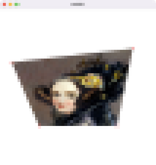

# Task01: 2D Homography Transformation

**Deadline: Apr 28th(Thu) at 15:00pm**

----

## Before Doing Assignment

If you have not done the [task0](../task01), do it first to set up the C++ graphics developtment environment.

Follow [this document](../doc/submit.md) to submit the assignment, In a nutshell, before doing the assignment,  
- make sure you synchronized the `main ` branch of your local repository  to that of remote repository.
- make sure you created branch `task01` from `main` branch.
- make sure you are currently in the `task01` branch (use `git branch -a` command).

Now you are ready to go!

---

## Problem 1

1. Build the code using cmake
2. Run the code
3. Take a screenshot image (looks like image at the top)
4. Save the screenshot image overwriting `task01/problem1.png`
 

## Problem 2

Write some code (about 20 lines) around `line #33` in `main.cpp` to define the Homographic transformation that maps image corners to the  red points. 

Save the screenshot image overwriting `task01/problem2.png`

## After Doing the Assignment

After modify the code, push the code and submit a pull request. 
