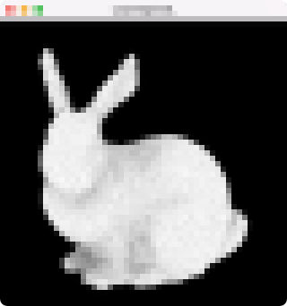

# Task04: Importance Sampling (Ambient Occlusion)

**Deadline: May 19th (Thu) at 15:00pm**

----

## Before Doing Assignment

If you have not done the [task00](../task00), do it first to set up the C++ graphics development environment.

Follow [this document](../doc/submit.md) to submit the assignment, In a nutshell, before doing the assignment,  
- make sure you synchronized the `main ` branch of your local repository  to that of remote repository.
- make sure you created branch `task04` from `main` branch.
- make sure you are currently in the `task04` branch (use `git branch -a` command).

Now you are ready to go!

---

## Problem 1

1. Build the code using cmake
2. Run the code
3. Take a screenshot image (looks like image at the top)
4. Save the screenshot image overwriting `task04/problem1.png`
 

## Problem 2

Write some code (about 5 ~ 7  lines) around `line #45` in `main.cpp` 
to sample direction and weight for cosine weighted multiple importance sampling.
After all, you will observe the faster convergence to the solution. 
Read the instruction in the `main.cpp` for more information.

Save the screenshot image overwriting `task04/problem2.png`

## After Doing the Assignment

After modify the code, push the code and submit a pull request. 
