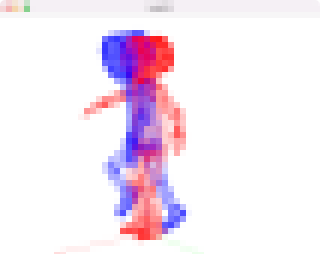

# Task06: Linear Blend Skinning (Articulated Rigid Body, Inverse Binding Matrix)

**Deadline: June 9th (Thu) at 15:00pm**

----

## Before Doing Assignment

If you have not done the [task00](../task00), do it first to set up the C++ graphics development environment.

Follow [this document](../doc/submit.md) to submit the assignment, In a nutshell, before doing the assignment,  
- make sure you synchronized the `main ` branch of your local repository  to that of remote repository.
- make sure you created branch `task06` from `main` branch.
- make sure you are currently in the `task06` branch (use `git branch -a` command).

Now you are ready to go!

---

## Problem 1

1. Build the code using cmake
2. Run the code
3. Take a screenshot image (looks like image at the top)
4. Save the screenshot image overwriting `task06/problem1.png`

## Problem 2

Write code at `line #209` and `line #228` to implement linear blend skinning for articulated rigid body.  

Save the screenshot image overwriting `task06/problem2.png`

## After Doing the Assignment

After modify the code, push the code and submit a pull request. 
