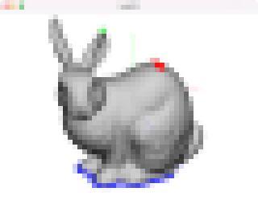

# Task08: Laplacian Mesh Deformation (Optimization, Sparse Matrix)

**Deadline: June 23rd (Thu) at 15:00pm**

----

## Before Doing Assignment

If you have not done the [task00](../task00), do it first to set up the C++ graphics development environment.

Follow [this document](../doc/submit.md) to submit the assignment, In a nutshell, before doing the assignment,  
- make sure you synchronized the `main ` branch of your local repository  to that of remote repository.
- make sure you created branch `task08` from `main` branch.
- make sure you are currently in the `task08` branch (use `git branch -a` command).

Now you are ready to go!

---

## Problem 1

1. Build the code using cmake
2. Run the code
3. Take a screenshot image (looks like image at the top)
4. Save the screenshot image overwriting `task08/problem1.png`

By the way, the view navigation of this program works as 
- rotation: `alt+left mouse button`,
- translation: `shift+left mouse button`
- scale: `mouse wheel`

## Problem 2

Write code at `line #129` to implement Laplacian mesh deformation.

Save the screenshot image overwriting `task08/problem2.png`

## After Doing the Assignment

After modify the code, push the code and submit a pull request. 
