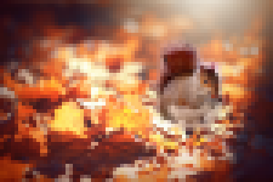

# Task09: Poisson Image Editing(Gauss-Seidel method, pybind11)



**Deadline: June 23rd (Thu) at 15:00pm**

----

## Before Doing Assignment

If you have not done the [task00](../task00), do it first to set up the C++ graphics development environment.

Follow [this document](../doc/submit.md) to submit the assignment, In a nutshell, before doing the assignment,  
- make sure you synchronized the `main ` branch of your local repository  to that of remote repository.
- make sure you created branch `task08` from `main` branch.
- make sure you are currently in the `task08` branch (use `git branch -a` command).

This assignment needs `pybind11` library. Download it with

```
cd acg-<username>
git submodule update externa/pibyind11
```

```sh
python3 -m pip install --upgrade pip
python3 -m pip install --upgrade numpy
python3 -m pip install --upgrade Pillow
```

Now you are ready to go!

---

## Problem 1

1. Build the code using cmake
2. Run the code with `python3 blend.py`
3. Take a screenshot image (looks like image at the top)
4. Save the screenshot image overwriting `task09/problem1.png`


## Problem 2

Write code at `line #45` to implement Laplacian mesh deformation.

Save the screenshot image overwriting `task09/problem2.png`


## After Doing the Assignment

After modify the code, push the code and submit a pull request. 


## Reference

- J. Matías Di Martino, Gabriele Facciolo, and Enric Meinhardt-Llopis, Poisson Image Editing, Image Processing On Line, 6 (2016), pp. 300–325. 
https://www.cs.jhu.edu/~misha/Fall07/Papers/Perez03.pdf
